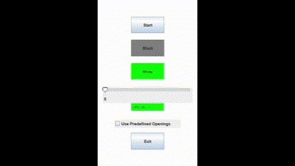
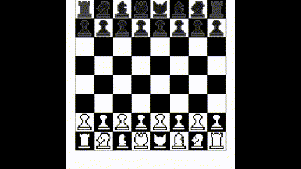

# ChessProject

# Project to create a chess game and AI.
The main goal of this project was to help myself develop a better understanding of simple artifical intelligence, UI design, gameloop, and multi-threading.

# Features
- Working dynamic difficulty (Can choose easier or harder AI to play against)
- Player choice on starting color
- Toggleable pre-programmed starting moves for AI
- All possible moves player can make are highlighted on board including advanced moves such as castling
- Relatively fast AI for number of computations

# StartUp

# Game

# Future additions/improvements
- Use arenas to find create better evaluation function based on a large numbers of trials
- Possible 4th level of difficulty involving neural network AI
- More pre-programmed starting moves
- More randomness to AI
